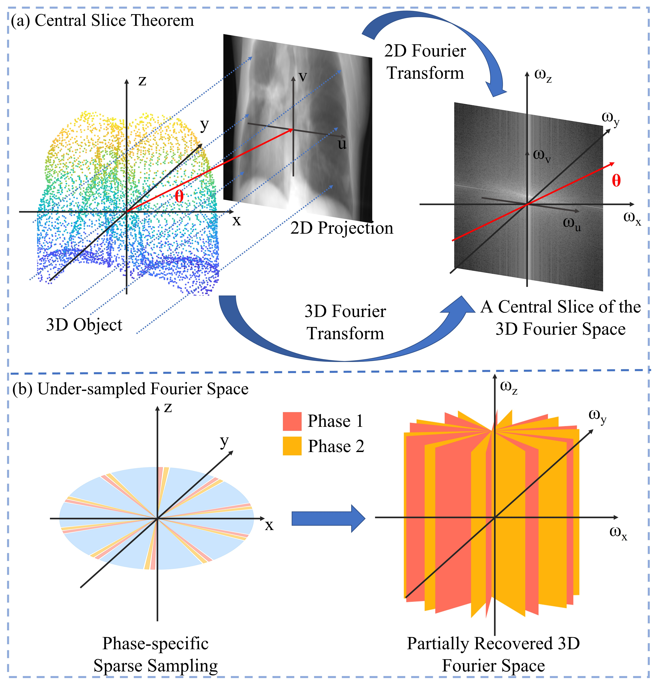
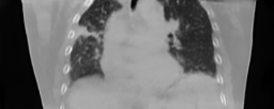
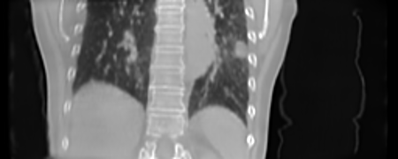

# RSTAR4D: <u>R</u>otational <u>ST</u>reak <u>A</u>rtifact <u>R</u>eduction in 4D CBCT using a Separable 4D CNN

http://arxiv.org/abs/2403.16361

Author: Ziheng Deng, Jun Zhao, School of BME, Shanghai Jiao Tong University

This repository is the official implementation of RSTAR4D. The main contributions of the paper are:

* We identified the rotational streak artifacts (RSA) in 4D CBCT image.
* We proposed the RSTAR-4DNet to effectively reduce the RSA in the spatiotemporal domain.
* We effectively trained a 4D CNN with limited computational resources and only dozens of 4D training samples.

## What is rotational streak artifacts (RSA)?

1. According to the respiratory signal, the projection data from a full-circular scan are sorted into 10 respiratory phases.

   

2. Within each phase, there are limited projection angles for CT reconstruction -> sparse-view reconstruction -> streak artifacts.

   

3. The distribution of streak artifacts is closely related to the projection sampling pattern.

   

4. The respiratory motion is quasi-periodic and sequential -> rotational projection sampling map.

3+4 -> RSA

|          Projection Sampling Map          |             Dynamic CBCT image (with RSA)              |
| :---------------------------------------: | :----------------------------------------------------: |
|  |  |

## Demo

Here are some results of our RSTAR-Net tested on __*real clinical CBCT scans*__. 

| Case  |               Uncorrected Image                |               Corrected Image                |
| :---: | :--------------------------------------------: | :------------------------------------------: |
| Case1 |  |  |
| Case2 |  |  |
| Case3 |  |  |

## RSTAR-4DNet

Code will be available if the paper is accepted.

